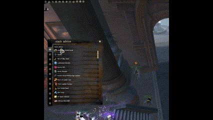

# gw2stacks
This is a port of zwei2steins [gw2stacks](https://github.com/zwei2stein/gw2stacks) to Blishhud.

Please report encountered errors either via pull requests or to ImDarla on the official Blishhud Discord.

## Tutorial

Basic functionality requires an API key with permissions for character, account and inventories to be added using the Blishhud API interface.

Clicking the cog icon next to the blish hud icon starts the process of retrieving the informaton of the current account.

After the information is retrieved and compiled a window with all of the gw2stacks advice tabs will be opened.

Clicking on one of the items opens a separate window containing the advice for this item, its location and its quantities on your account.

## Notes
All crafting and salvage advice does not take TP prices into account at this point in time.

## Permission
I got written permission by zwei2stein on reddit to create this module

## Error Behaviour
If the spinning load indicator is still present information is still being retrieved and compiled.

On a fatal error or api error the load indicator and cog icon disappear.

In the case of an API error the module will keep checking on every api key change and try to recover a valid state
