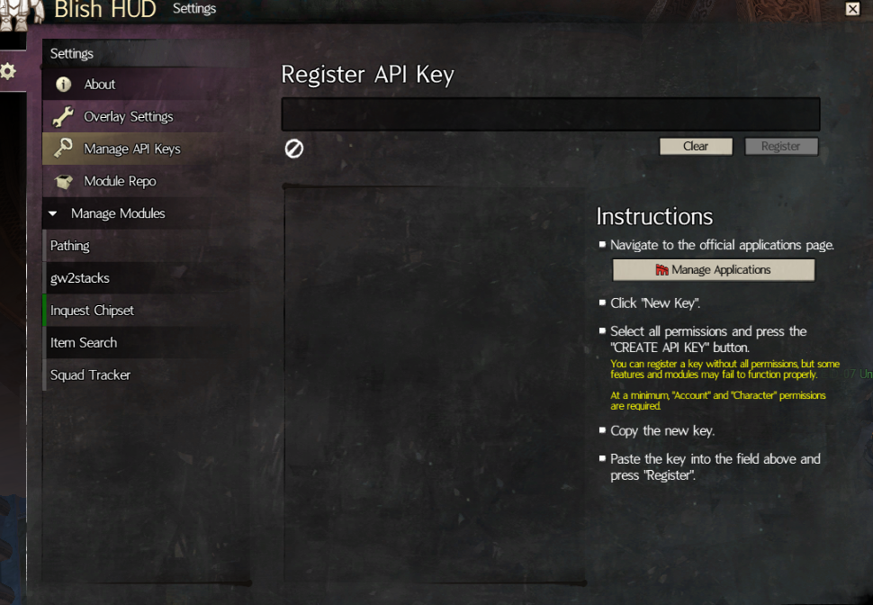
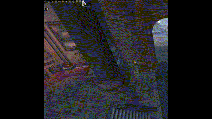
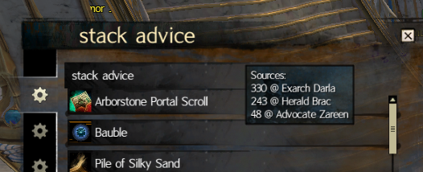
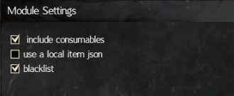
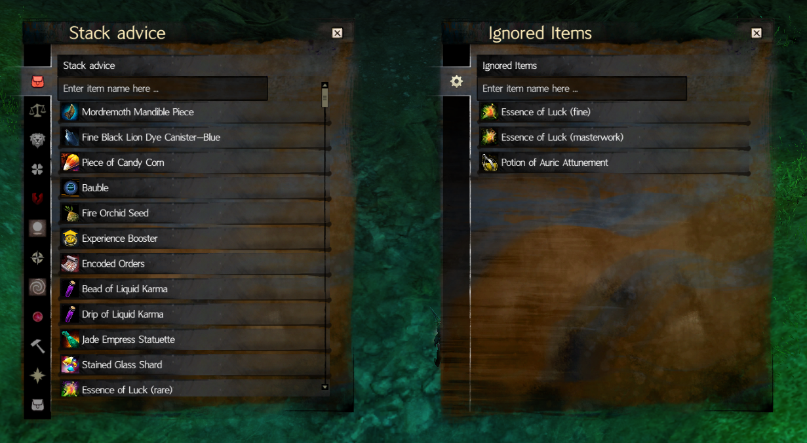
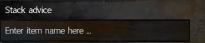

# gw2stacks
This is a port of zwei2steins [gw2stacks](https://github.com/zwei2stein/gw2stacks) to Blishhud.

Please report encountered errors either via pull requests or to ImDarla on the official Blishhud Discord.

## Tutorial

Basic functionality requires an API key with permissions for character, account and inventories to be added using the Blishhud API interface.

Clicking the cog icon next to the blish hud icon starts the process of retrieving the informaton of the current account.

After the information is retrieved and compiled a window with all of the gw2stacks advice tabs will be opened.

Hovering over one of these items will display the advice for this item, its location and its quantities on your account.

The blacklist feature for items can be enabled in the module settings.

Clicking on an Item in the advice list with the blacklist feature enabled, ignores the items from further advice. Blacklisted items are saved localy between module executions.

Searching for an item name filters for this specific item. This feature ignores case and takes module localisation into account.

## Notes
Korean and spanish translations are currently missing and will revert to english for the advice sections

## Permission
I got written permission by zwei2stein on reddit to create this module

## Q&A
>The initial loading takes a long time

Despite only requesting the minimum amount of information to the API, the bucket structure of blishhud api calls might delay requests by some time.

>The module seems frozen

On error the module will remove its UI elements and log the error to the Blishhud log file of the session.

>Inventory changes are not displayed

The api requests have an internal cooldown of 5 minutes to reduce this modules impact on other modules.

## Planned features

* Translation for spanish (and potentially korean) users
